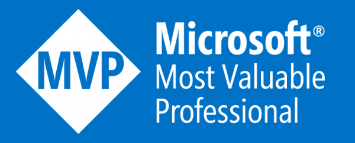

### Zawodowo
Doradzam firmom w doborze technologii i w budowaniu strategii IT. Wraz z przyjaciółmi, Łukaszem i Szymonem, rozwijam firmę doradczą [Protopia](https://protopia.tech).  
Jestem liderem warszawskiej [grupy Azure](https://www.facebook.com/groups/azureugpl/), Microsoft Azure [MVP](https://mvp.microsoft.com/en-us/PublicProfile/5003117) i certyfikowanym trenerem Microsoft.  
Moją pasją są nowe technologie, chmura publiczna oraz tematyka bezpieczeństwa IT.
{: style="text-align: justify;"}

### Prywatnie
Mąż i tata trzech wspaniałych córek, z którymi spędzam więkość swojego wolnego czasu. Jakiś czas temu wyprowadziłem się do małej wioski zdala od warszawskiego zgiełku.
{: style="text-align: justify;"}

### _

