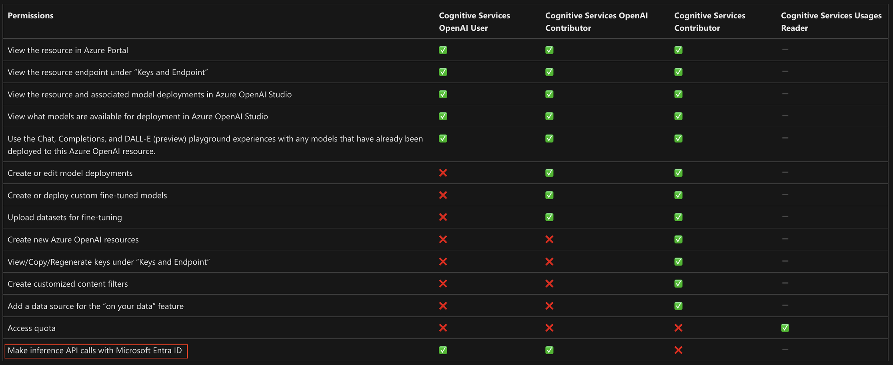

W poprzednim artykule omówiłem scenariusze balansowania ruchu przez APIM (Azure API Management) pomiędzy wieloma instancjami Azure OpenAI. Jeśli jeszcze nie miałaś/eś okazji się z nim zapoznać, gorąco zapraszam do lektury!

W tej części skupię się na scenariuszach kontroli dostępu do usługi. Jakie modele dostępu są wspierane przez Azure OpenAI i jak zaprząc do tego APIMa, by zrealizować wymagania uwierzytelniania i autoryzacji w Twojej firmie lub projekcie.

### Metody uwierzytelniania w Azure OpenAI

Usługa wspiera dwa sposoby uwierzytelniania wysyłanych żądań do API, są to:

- Uwierzytelnianie przy pomocy klucza. W takim podejściu mamy obowiązek załączyć nagłówek HTTP o nazwie "api-key" i w jego wartości przekazać współdzielony klucz do usługi.
- Uwierzytelnianie przy pomocy tożsamości Entra ID (użytkownicy, aplikacje, managed identity). W takim przypadku "logujemy się" do Azure pozyskując token JWT. Następnie token dołączamy w nagłówku HTTP "Authorization" jako Bearer.

W tym miejscu warto podkreślić, że według [Azure Security Benchmark](https://learn.microsoft.com/en-us/security/benchmark/azure/security-controls-v3-identity-management) wskazane jest używanie Entra ID. Może się jednak zdarzyć, że biblioteki lub rozwiązania integrujące się z OpenAI nie potrafią posłużyć się logowaniem z Entra ID. Wykonujemy wtedy analizę ryzyka i docelowo włączamy klucze jako odstępstwo od tej reguły.

Pewnie się zastanawiasz, dlaczego klucze nie są rekomendowane. Oto kilka powodów:

- Nie wspierają granularnych uprawnień.
- Jeden klucz jest przekazywany do wielu aplikacji i trudno zweryfikować kto wysyła żądanie.
- Mocno utrudnione jest zarządzanie ich cyklem życia. Klucze trzeba rotować jednorazowo w wielu aplikacjach i systemach.
- Nie mamy kontroli gdzie, kiedy i jak taki klucz jest przechowywany w aplikacji, a to grozi jego wyciekiem.

### Kontrola dostępu - RBAC

Jeżeli skonfigurujesz usługę Azure OpenAI zgodnie z powyższymi rekomendacjami możesz ustawić poszczególnym osobom czy aplikacjom uprawnienia w oparciu o RBAC (Role-Based Access Control).

Takie uprawnienia mogą być nadawane całym grupom, na różnych poziomach w usłudze, wliczając w to pojedyncze modele. Istnieje oczywiści możliwość budowania własnych ról z uprawieniami, ja jednak preferuje te wbudowane, dostarczone przez platformę Azure.

Poniższa tabela zawiera informacje na temat uprawnień wynikających z poszczególnych ról w usłudze. Tabela nie zawiera wprawdzie wszystkich "built-in", ale daje niezły pogląd na kierunek w jakim możesz podążać. Koniecznie zwróć uwagę na uprawienie do wysyłania żądań API do modeli (zaznaczone na czerwono).



### APIM i walidacja tokenów

Załóżmy że używamy już APIMa chociażby z powodu balansowania ruchu opisanego w artykule, lub będziemy go używać do rozliczania tokenów, limitowania, logowania. W najprostszym scenariuszu możemy zwyczajnie przepuścić żądanie HTTP dalej bez jakichkolwiek modyfikacji na poziomie kontroli dostępu. Zrzucamy wszystkie decyzje autoryzacyjne na barki Azure OpenAI.

Bardziej zaawansowane podejście będzie wiązało się z wykonaniem [prewalidacji tokenu](https://learn.microsoft.com/en-us/azure/api-management/validate-azure-ad-token-policy) - co kryje się pod tym pojęciem?

Na wejściu "oglądamy" token JWT i jeżeli spełnia nasze wymagania (czas życia, kto go wystawił, komu wystawił, czy docelowym systemem jest OpenAI), puszczamy żądanie dalej i znów oddajemy decyzję autoryzacyjną instancji Azure OpenAI (i jej ustawieniom RBAC). Tym sposobem jesteśmy w stanie odciąć, centralnie monitorować i poprawnie obsłużyć wszystkie nieuwierzytelnione wywołania usługi. Kod polityki może wyglądać wtedy następująco:

```xml
<policies>
    <inbound>
        <base />
        <validate-azure-ad-token tenant-id={{entra-tenant-id}} header-name="Authorization" failed-validation-httpcode="401" failed-validation-error-message="Unauthorized. Access token is missing or invalid.">
            <client-application-ids>
                <application-id>{{aad-client-application-id1}}</application-id>
                <application-id>{{aad-client-application-id2}}</application-id>
            </client-application-ids>
             <required-claims>
                <claim name=...>
                    <value>...</value>
                </claim>
            </required-claims>
        </validate-azure-ad-token>
    </inbound>
    <backend>
        <base />
    </backend>
    <outbound>
        <base />
    </outbound>
    <on-error>
        <base />
    </on-error>
</policies>
```

W trzecim scenariuszu, jeżeli chcemy by aplikacje lub użytkownicy nie mieli bezpośredniego RBAC na instancjach Azure OpenAI możemy nadać takie uprawnienia tylko APIMowi. W takim modelu APIM ogląda token, sprawdza wymagane claimy i już z tokenem swojego MSI wykonuje pod spodem żądanie. Kod jest dość podobny, ale tym razem generujemy token MSI dla APIMa i robimy podmianę.

```xml
<inbound>
        <base />
       <validate-azure-ad-token tenant-id={{entra-tenant-id}} header-name="Authorization" failed-validation-httpcode="401" failed-validation-error-message="Unauthorized. Access token is missing or invalid.">
            <client-application-ids>
                <application-id>{{aad-client-application-id1}}</application-id>
                <application-id>{{aad-client-application-id2}}</application-id>
            </client-application-ids>
            <required-claims>
                <claim name=...>
                    <value>...</value>
                </claim>
            </required-claims>
        </validate-azure-ad-token>
        <authentication-managed-identity resource="https://cognitiveservices.azure.com" output-token-variable-name="managed-id-access-token" ignore-error="false" />
        <set-header name="Authorization" exists-action="override">
            <value>@("Bearer " + (string)context.Variables["managed-id-access-token"])</value>
        </set-header>
    </inbound>
```

### Autoryzacja tożsamości spoza naszej firmy

Powyższe scenariusze działają w przypadku gdy bazujemy na Entra ID, czy naszym Active Directory podłączonym do Entry. Sprawa komplikuje się, gdy w organizacji używane są inne rozwiązania do zarządzania tożsamością. W tym przypadku pewnie i tak ustawiona jest federacja i RBAC funkcjonuje poprawnie. Co jednak, gdy wystawiamy aplikację na zewnątrz i nie dajemy potencjalnym użytkownikom "loginu" w naszej firmie? Tutaj mamy kilka opcji:

- Użytkownicy i aplikacje uwierzytelniają się w oparciu o znaną nam zewnętrzną tożsamość (np rozwiązanie klasy CIAM).
- Zezwalamy użytkownikom na rejestrację przez [Deweloper Portal](https://learn.microsoft.com/en-us/azure/api-management/developer-portal-overview) w APIM, czyli miejsce gdzie po naszej akceptacji zakładają sobie sami konta, sami generują klucze/tokeny. Model ten jest popularny w aplikacjach SaaS i wszelkich podejściach "na subskrypcję".
- Odwołujemy się do bliżej nieokreślonego zewnętrznego systemu autoryzacyjnego. W mojej praktyce zdarzało się integrować z takimi systemami stworzonymi w firmie, które pomijały popularne standardy i robiły rzeczy po swojemu.

**W pierwszym przypadku** używamy ponownie prewalidacji tokenu, ale tym razem zamiast "validate-azure-ad-token" używamy jej bardziej zaawansowanej odmiany "[validate-jwt](https://learn.microsoft.com/en-us/azure/api-management/validate-jwt-policy)". Poprzez wskazanie wystawcy tokenów (issuer) możemy się zintegrować z praktycznie każdym IDP, które wspiera OpenID Connect. Możemy walidować tokeny za pomocą kluczy z JWKS lub dostarczonych lokalnie, wspieramy szyfrowanie tokenów, dopuszczamy odchylenia czasowe itp.

**W drugim przypadku** [subskrypcje](https://learn.microsoft.com/en-us/azure/api-management/api-management-subscriptions) APIM ogranie nam samodzielnie. Musimy jedynie wymusić na poziomie wystawianego API, by wymagał aktywnej subskrypcji w Deweloper Portalu dla wskazanego użytkownika. W takim przypadku użytkownik będzie zmuszony dokleić swój klucz subskrypcyjny do wysyłanego żądania.

**W trzecim przypadku** musimy się trochę bardziej napracować. W zależności od systemu zewnetrznego może to być użycie bardziej rozbudowanych polityk, w tym takich które wykonują dodatkowe zapytania autoryzacyjne albo wykorzystują inne algorytmy szyfrowania. Przykład takiej polityki znajdziesz [tutaj](https://github.com/Azure/api-management-policy-snippets/blob/master/examples/Authorize%20requests%20using%20external%20authorizer.policy.xml) i [tutaj](https://github.com/Azure/api-management-policy-snippets/blob/master/examples/Create%20HMAC%20SHA256-Signed%20JWT.policy.xml).

Oczywiście powyższe scenariusze nie wykluczają użycia klasycznego basic authentication, certificate authentication lub mTLS. Te z kolei metody ponownie mogą być zastąpione w locie tożsamością APIMa i jego MSI, jak to opisywałem wcześniej.

### Podsumowanie

Jak widzisz tematyka kontroli dostępu w Azure OpenAI i w APIM nie należy do najłatwiejszych i wymaga specyficznej wiedzy. W zależności od założeń architektonicznych możemy jednak wykorzystać któreś z powyższych podejść.

Najważniejsze rzeczy do zapamiętania:

- W Azure OpenAI możemy uwierzytelniać się za pomocą Entra ID z RBAC, oraz za pomocą kluczy. Uzycie kluczy nie jest rekomendowane.
- W APIM możemy walidować tokeny pochodzące zarówno z Entra ID, sfederowanych z nią systemów, jak też innych rozwiązań bazujących na OpenID Connect.
- Podczas walidacji możemy puszczać żądania dalej (pass-thru), lub podstawiać token APIMa.
- Bardziej zaawansowane scenariusze mogą skutkować potrzebą tworzenia skomplikowanych polityk w APIM.

Za tydzień opublikuje kolejny artykuł o tym, jak kontrolować wykorzystanie tokenów OpenAI przy pomocy APIMa. Zapraszam do [śledzenia](https://www.linkedin.com/mynetwork/discovery-see-all/?usecase=PEOPLE_FOLLOWS&followMember=grabarz) mojego profilu, by go nie przegapić.
