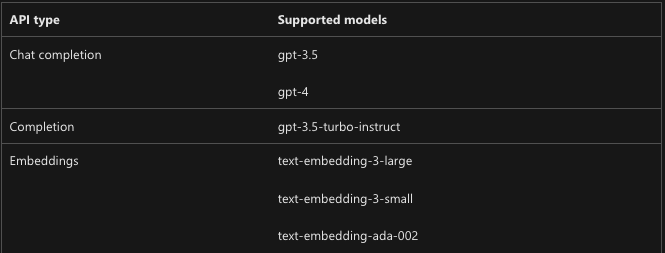

To już trzeci artykuł dotyczący AI Gateway, czyli połączenia APIM (Azure API Management) wraz z Azure OpenAI. W serii postanowiłem opisać korzyści z takiej konfiguracji oraz wytłumaczyć jak samodzielnie możesz ją stworzyć.

W pierwszym wpisie opisywałem balansowanie ruchu między wieloma instancjami OpenAI, w drugim znajdziesz informacje na temat kontroli dostępu (uwierzytelnianie, autoryzacja). Dzisiaj na tapet bierzemy rate limiting, czyli kontrole ilości wysyłanych żądań do OpenAI, jak też kontrolę ilości konsumowanych tokenów.

### Rate limiting, ale o co chodzi?

Jednym z często pojawiających się pytań w kontekście Azure OpenAI jest pytanie o kontrolę kosztów i wykorzystanie tokenów.

Na pewnym etapie nasze instancje OpenAI będą wykorzystywane przez różne aplikacje, czy różnych użytkowników w ramach pojedynczej aplikacji. To oczywiście może generować koszty, które chcielibyśmy jakoś rozdzielać, kontrolować, ograniczać.

Kolejny aspekt to wspomniane już przez mnie w pierwszym artykule [limity](https://learn.microsoft.com/en-us/azure/ai-services/openai/quotas-limits#quotas-and-limits-reference). W przypadku używania OpenAI w modelu PTU (Provisioned Throughput Units) znamy te limity, sami za nie płacimy. W przypadku modelu PAYG (Pay as you go) limity też istnieją i co gorsza, co współdzielone pomiędzy wiele instancji OpenAI w ramach jednego regionu i subskrypcji.

Oczywiście możemy balansować ruch, by powyższe ograniczenia ominąć, ale możesz rozważyć dodatkowy sposób. Jaki? Możemy pozwolić aplikacji X, czy użytkownikowi Y na wysyłanie maksymalnie 10 zapytań na minutę i konsumpcję nie więcej niż 10k tokenów. Takie ograniczenie to właśnie **rate limiting**. Często pojawiają się inne zbliżone określenia jak **quota**, albo API **throttling** ale w zasadzie pomysł jest podobny, chodzi o wydzielanie pewnych limitów w ramach współdzielonej puli zasobów, serwerów, instancji itp.

### Polityki w API Management

W klasycznym podejściu do ustawiania limitów można posiłkować się czterema politykami:

- [quota](https://learn.microsoft.com/en-us/azure/api-management/quota-policy), [rate-limit](https://learn.microsoft.com/en-us/azure/api-management/rate-limit-policy) - kontrola ilości wywołań (RPM) albo przepustowości dla wskazanego API, metody, zestawu API. Limit zliczany jest dla każdego użytkownika APIM osobno.
- [quota-by-key](https://learn.microsoft.com/en-us/azure/api-management/quota-by-key-policy), [rate-limit-by-key](https://learn.microsoft.com/en-us/azure/api-management/rate-limit-by-key-policy) - działa tak, jak powyższe ale zamiast zliczać dla użytkownika to my decydujemy jak to policzymy. Może to być np na adres IP, albo na użytkownika z Entra ID, albo sumarycznie dla członków wskazanej grupy z Active Directory.

Różnica między politykami quota i rate-limit jest w zasadzie niewielka. Ta pierwsza przeznaczona jest dla scenariuszy operujących w dniach lub na cały miesiąc, a rate-limit głównie w scenariuszach nagłych i niespodziewanych wzrostów użycia API. Obie metody mają nieco inną wewnętrzną implementację i w konsekwencji:

- qouta działa wolniej, ale za to bezbłędnie wszystko zlicza. Po przekroczeniu limitu zwraca kod błędu HTTP 403 Forbidden,
- rate limit ma nieco bardziej rozproszoną naturę, działa od ręki ale dopuszcza się, że może wpuścić kilka żądań powyżej limitu zanim zacznie blokować. Po przekroczeniu limitów zwraca kod błędu HTTP 429 TooManyRequests.

Jak wyglądają przykłady ich użycia?

```xml
<rate-limit-by-key  calls="10"
          renewal-period="60"
          counter-key="@(context.Request.IpAddress)" />

<quota-by-key calls="1000000"
          bandwidth="10000"
          renewal-period="2629800"
          counter-key="@(context.Request.IpAddress)" />
```

Limit dla każdego adresu IP na 10 wywołań API na minutę oraz sumarycznie milion wywołań miesięcznie (wraz z 10MB transferu danych miesięcznie).

Inny przykład?

```xml
<rate-limit-by-key calls="10"
    renewal-period="60"
    counter-key="@(context.Request.Headers.GetValueOrDefault("Authorization","").AsJwt()?.Subject)" />
```

Limit 10 wywołań na minutę dla każdej tożsamości z Entra ID.

### Jak liczyć limity na tokeny w OpenAI?

Przy pomocy powyższych polityk możesz kontrolować ilość zapytań na minutę (RPM), ilość równoczesnych zapytań np do DALL-E, transfery danych itp. Jak jednak poradzić sobie z tokenami?

Okazuje się, że APIM ma do tego dedykowaną politykę [azure-openai-token-limit](https://learn.microsoft.com/en-us/azure/api-management/azure-openai-token-limit-policy).

Polityka wyciąga informacje na temat użytych tokenów z odpowiedzi zwracanych przez API OpenAI i zlicza je do określonego limitu. Po jego przekroczeniu zachowuje się tak, jak polityki rate-limit, które omawialiśmy wcześniej. Dodatkowo możesz zwracać w odpowiedzi z API informację ile tokenów zużyto i ile ich jeszcze zostało w ramach limitu.

Dodatkowo możesz włączyć szacowanie użycia tokenów, zanim samo pytanie zostanie wysłane do OpenAI. W takim przypadku APIM odrzuci zbyt duże zapytania, albo te mniejsze, gdy zbliżamy się niebezpiecznie blisko do limitu. Opcja ta jest wymuszana w przypadku streaming API, to czy ustawisz true/false nie ma znaczenia.

Wraz z fragmentami opisywanymi w poprzednich artykułach polityka może wyglądać następująco:

```xml
<policies>
    <inbound>
        <base />
        <authentication-managed-identity resource="https://cognitiveservices.azure.com" output-token-variable-name="managed-id-access-token" ignore-error="false" />
        <set-header name="Authorization" exists-action="override">
            <value>@("Bearer " + (string)context.Variables["managed-id-access-token"])</value>
        </set-header>
        <set-backend-service backend-id="{backend-id}" />
        <azure-openai-token-limit counter-key="@(context.Request.IpAddress)"
            tokens-per-minute="500" estimate-prompt-tokens="false" remaining-tokens-variable-name="remainingTokens">
        </azure-openai-token-limit>
    </inbound>
    <backend>
        <base />
    </backend>
    <outbound>
        <base />
    </outbound>
    <on-error>
        <base />
    </on-error>
</policies>
```

Według dokumentacji, wspierane są obecnie następujące modele w ramach Azure OpenAI. Jestem jednak pewien, że lista ta będzie sukcesywnie rozszerzana.



### Podsumowanie

Dzięki politykom dostarczanym przez API Management możesz w dość elastyczny sposób kontrolować kto, kiedy i z jaką intensywnością korzysta z instancji OpenAI.

Polityki umożliwią ci kontrolowanie ilości wywołań na minute (RTM), ilości konsumowanych tokenów (TPM), a nawet wolumenów przesyłanych danych albo ilości równoczesnych zapytań do API.

Limity możesz ustawić dla użytkownika, aplikacji, adresu IP, grupy AD lub dowolnego innego klucza, który jesteś w stanie określić w momencie przetwarzania wysłanego zapytania do API.

Zapraszam Cię do [śledzenia](https://www.linkedin.com/mynetwork/discovery-see-all/?usecase=PEOPLE_FOLLOWS&followMember=grabarz) mojego profilu i odkrywania, jak APIM może stać się Twoim sprzymierzeńcem w świecie AI.

Za tydzień omówimy tematy związane z logami naszego API Gateway:

- Jak zapisywać metryki użycia tokenów i je potem rozliczać.
- Jak zbierać zawartość promptów i odpowiedzi.
- Jak reagować na nieautoryzowane żądania do naszego API.
- Jak przekierować takie logi do np bazy danych, kont log analytics, do SIEM itp.
