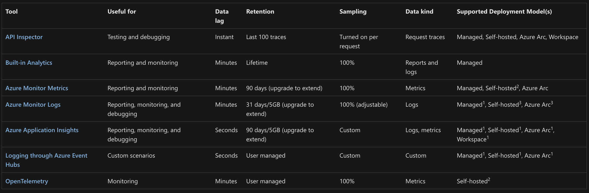

W podsumowaniu poprzedniego artykułu zapowiedziałem, że tym razem wspólnie zajmiemy się szeroko pojętą tematyką observability w API Management, ze szczególnym uwzględnieniem potrzeb Azure OpenAI.

Co kryje się pod określeniem observability? W tym temacie sporo pisze [Szymon Warda](https://www.linkedin.com/in/szymonwarda/), więc warto zajrzeć na jego profil. Ja uproszczę moje dzisiejsze rozważania do kilku obszarów związanym z monitorowaniem, zbieraniem logów, diagnozowaniem i rozliczalnością wywołań API na platformie API Management.

### Co oferuje APIM w obszarze observability?

Kiedy prezentuję swoim klientom możliwości API Management w obszarze monitorowania i zbierania logów zwykle posiłkuje się dwoma slajdami. Drugi z nich dotyczy tak zwanego self-hosted gateway, więc zostawię go na potrzeby kolejnych artykułów. Pierwszy z kolei wylicza poszczególne z dostępnych opcji:



Jak widzisz możliwości jest sporo. My skupimy się dzisiaj na tych, które wydają się szczególnie ciekawe w kontekście OpenAI. Dla jasności - pozostałe też są ważne, chociażby w kontekście działania i wydajności całej platformy.

### Azure Monitor Logs

Domyślnym mechanizmem zbierania logów jest ich wysyłka do konta Log Analytics w Azure (opcjonalnie kilku kont, do Event Huba, albo Storage) tak zwanych **GatewayLogs**. Konfiguracja miejsca docelowego nie odbywa się jednak na poziomie polityki, jak miało to miejsce w przypadku moich wcześniejszych artykułów, ale na poziomie tak zwanych **Diagnostic Settings.**

Z kolei na poziomie konfiguracji poszczególnych API możemy zdecydować co w tych logach zostanie wrzucone poza domyślnymi elementami (data, kod, api, metoda). Te rozszerzone opcje pozwalają nam zalogować nagłówki, treść żądania i odpowiedzi oraz zdecydować o poziomie samplingu, czyli procentowej ilości w pełni zalogowanych wywołań API.

Całościowo schema takich logów wygląda następująco: [Reference - Azure API Management gateway log](https://learn.microsoft.com/en-us/azure/api-management/gateway-log-schema-reference)

W obszarze zbierania logów dla wywołań OpenAI dostajemy możliwość zbierania historii wywołań, czasów, adresów IP, nagłówków czy nawet zawartości promptów i odpowiedzi. Jest jednak mały haczyk...

Wielkość logowanej zawartości request/response jest w logach ograniczona do 8 kB. Jeżeli planujesz zalogować całą treść, niestety rozwiązanie to może być niewystarczające.

### Log to Azure Event Hub

Jeżeli chcemy wyjść poza powyżej wspomniane ograniczenia musimy posłużyć się mechanizmem logowania, który pozwala zbudować własny schemat wiadomości i samodzielnie ten schemat wypełnić danymi.

W tym celu w APIM konfigurujemy "logger", czyli docelowy Event Hub, do którego będziemy wysyłać wiadomości, a następnie przy pomocy polityki wpychamy do niego wiadomości. Taką politykę, co po krótkim zastanowieniu wydaje się oczywiste, wykonujemy dopiero gdy przetwarzamy odpowiedź otrzymaną z OpenAI (sekcja outbound). Całość wygląda następująco:

```xml
<policies>
    <inbound>
        <base />
        <authentication-managed-identity resource="https://cognitiveservices.azure.com" output-token-variable-name="managed-id-access-token" client-id="{{managed-identity-clientid}}" ignore-error="false" />
        <set-header name="Authorization" exists-action="override">
            <value>@("Bearer " + (string)context.Variables["managed-id-access-token"])</value>
        </set-header>
        <set-backend-service backend-id="{backend-id}" />
        <set-variable name="requestBody" value="@(context.Request.Body.As<string>(preserveContent: true))" />
    </inbound>
    <backend>
        <base />
    </backend>
    <outbound>
        <base />
        <choose>
            <when condition="@(context.Response.StatusCode == 200)">
                <log-to-eventhub logger-id="{eventhub-logger-name}">@{
                    var requestBody = (string)context.Variables["requestBody"];
                    var responseBody = context.Response.Body?.As<JObject>(preserveContent: true);
                    return new JObject(
                        new JProperty("id", responseBody?["id"]?.ToString() ?? Guid.NewGuid().ToString()),
                        new JProperty("timestamp", DateTime.UtcNow.ToString()),
                        new JProperty("model", responseBody?["model"]?.ToString() ?? "NA"),
                        new JProperty("modelRegion", context.Response.Headers.GetValueOrDefault("x-ms-region", "N/A")),
                        new JProperty("apimRequestId", context.Response.Headers.GetValueOrDefault("apim-request-id", "N/A")),
                        new JProperty("clientIp", context.Request?.IpAddress ?? "NA"),
                        new JProperty("operationName", context.Operation?.Name ?? "NA"),
                        new JProperty("request", requestBody),
                        new JProperty("response", responseBody?["choices"]?.ToString() ?? "N/A"),
                        new JProperty("promptTokens", responseBody?["usage"]?["prompt_tokens"]?.ToString() ?? "0"),
                        new JProperty("responseTokens", responseBody?["usage"]?["completion_tokens"]?.ToString() ?? "0"),
                        new JProperty("totalTokens", responseBody?["usage"]?["total_tokens"]?.ToString() ?? "0")
                        ).ToString();
                    }</log-to-eventhub>
            </when>
        </choose>
    </outbound>
    <on-error>
        <base />
    </on-error>
</policies>
```

Jak widzisz, możemy tam zalogować znacznie więcej istotnych informacji. Ograniczenia na wielkość wiadomości dalej istnieją, ale tym razem wynikają z usługi Event Hub i wynoszą 256 kB. W powyższym przykładzie logujemy między innymi region, model, liczbę skonsumowanych tokenów, treść pytania i treść udzielonej odpowiedzi.

Oczywiście istnieją dziesiątki możliwych scenariuszy jak dalej przetworzyć dane lądujące w Event Hub. Możesz użyć Stream Analytics, zrzucać je do baz danych, Storage Account czy też korzystać z integracji dostarczanych przez firmy trzecie - w taki sposób zdarza mi się wpinać logi do SIEM takich jak Splunk, czy QRadar.

Uwaga - Azure Monitor Logs też mogą być wysyłane do Event Hub, ale jak już wiesz, tylko 8kB i z góry określonym formacie. Do Ciebie należy wybór najlepszego mechanizmu.

### Azure Application Insights

Kolejną metodą na logowanie jest użycie Azure Application Insights. W związku z tym, że wpisy pojawiają się tam szybciej niż w Log Analytics, warto używać tej metody w scenariuszach poszukiwania błędów, monitorowania, robienia tracingu wywołań i wpływu zależnych usług na działanie (świetny [Application Map](https://learn.microsoft.com/en-us/azure/azure-monitor/app/app-map?tabs=net)).

W Application Insights możemy też zalogować ilość zużywanych tokenów w zapytaniach OpenAI. Możesz zarzucić, że przecież już to logujemy w poprzednich metodach - a do Event Huba to nawet jako osobne pole. Problemem może okazać się użycie streamingu w OpenAI. Mamy problem - jest też [rozwiązanie](https://learn.microsoft.com/en-us/azure/api-management/azure-openai-emit-token-metric-policy)!

Poniższy fragment polityki rozwiąże ten problem i wrzuci wpis do Application Insights:

```xml
<inbound>
        <base />
        <authentication-managed-identity resource="https://cognitiveservices.azure.com" output-token-variable-name="managed-id-access-token" ignore-error="false" />
        <set-header name="Authorization" exists-action="override">
            <value>@("Bearer " + (string)context.Variables["managed-id-access-token"])</value>
        </set-header>
        <set-backend-service backend-id="{backend-id}" />
        <azure-openai-emit-token-metric namespace="openai">
            <dimension name="Subscription ID" value="@(context.Subscription.Id)" />
            <dimension name="Client IP" value="@(context.Request.IpAddress)" />
            <dimension name="API ID" value="@(context.Api.Id)" />
            <dimension name="User ID" value="@(context.Request.Headers.GetValueOrDefault("x-user-id", "N/A"))" />
        </azure-openai-emit-token-metric>
</inbound>
```

Dla łatwości przeszukiwania, grupowania i filtrowania masz możliwość określenia własnych wymiarów wraz z ich wartościami. To z kolei pozwoli rozliczyć użycie na poszczególne osoby, aplikacje, czy działy w Twojej firmie.

### Podsumowanie

Różnych mechanizmów w API Management służących monitorowaniu, logowaniu, zbieraniu diagnostyki jest cała masa. Często ich możliwości i funkcje mocno na siebie nachodzą, dlatego warto dobrze im się przyjrzeć i mieć precyzyjne oczekiwania.

Sprawa komplikuje się jeszcze bardziej, kiedy zaczynamy używać Self-Hosted Gateway, czyli bramy API w Twoim środowisku on-premises lub multicloud. Myślę, że architektura hybrydowa APIM pojawi się jeszcze w kontekście hostowania własnych modeli AI - bo przecież nie jesteśmy zmuszeni używać jedynie Azure OpenAI

Zapraszam Cię do [śledzenia](https://www.linkedin.com/mynetwork/discovery-see-all/?usecase=PEOPLE_FOLLOWS&followMember=grabarz) mojego profilu i odkrywania, jak APIM może stać się Twoim sprzymierzeńcem w świecie AI.
